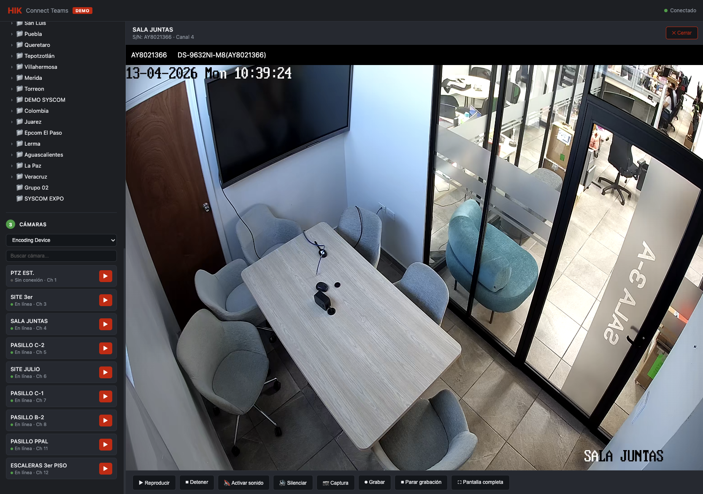

# Demo Video — HikConnect Teams OpenAPI

Demo interactivo que muestra cómo autenticarse con la API de HikConnect Teams, explorar áreas y cámaras, y reproducir video en vivo usando EZUIKit.



## Requisitos

- Node.js >= 22

## Instalación y uso

```bash
cd API-DOCS/hikvision/HikConnect-Team/demos/video
npm install
npm start
```

Abre el navegador en `http://localhost:3000`.

## Pasos en la interfaz

1. **Autenticación** — Selecciona tu región, ingresa App Key y Secret Key, y haz clic en _Iniciar sesión_.
2. **Áreas** — Se carga automáticamente el árbol de áreas de tu cuenta. Haz clic en un área para ver sus cámaras.
3. **Cámaras** — Haz clic en ▶ junto a cualquier cámara para reproducir el video en vivo.

## Estructura

```
API-DOCS/hikvision/HikConnect-Team/demos/video/
├── index.html          # Interfaz del demo (dark UI, EZUIKit)
├── server.js           # Proxy Node.js/Express (resuelve CORS)
├── package.json
├── ezuikit.js          # SDK de reproducción de Hikvision
└── ezuikit_static/     # Assets estáticos del SDK (WASM, CSS, imágenes)
```

## Nota sobre CORS

Los endpoints de HikConnect no aceptan solicitudes directas desde el navegador. `server.js` actúa como proxy local: todas las llamadas a la API se envían a `/proxy` y el servidor las reenvía a HikConnect. Solo se permiten dominios de Hikvision (`hikcentralconnect.com`, `hikcentralconnectru.com`, `ezvizlife.com`).

Este proxy es para uso en desarrollo/demo. No lo expongas en producción sin autenticación adicional.
